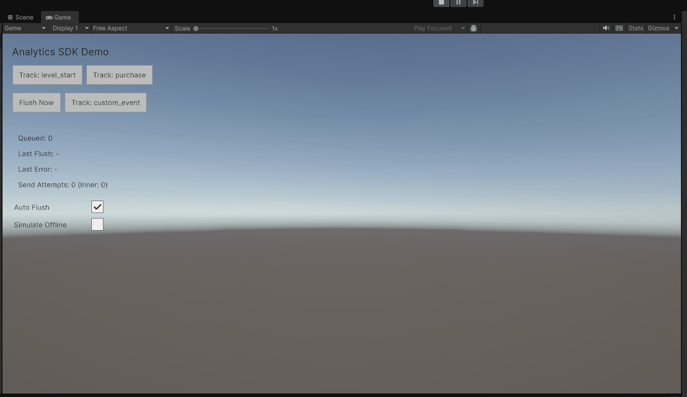

# Ashutosh Analytics SDK (Unity UPM Package)

A lightweight, SDK-style analytics package for Unity that focuses on **safe event tracking** and a **reliable send pipeline**:
- Input validation & sanitization for event properties
- Deterministic JSON payload serialization (stable ordering/formatting)
- Pluggable transports (Mock + UnityWebRequest)
- In-memory queue with batching + manual flush + timed auto-flush
- Small runtime stats API for demo/debugging

Built and tested on **Unity 6000.3 (Unity 6.3 LTS)**.

---

## What it does

You call `Track()` from gameplay/UI code with an event name and properties. The SDK:

1. **Validates + sanitizes** the event (drops unsupported property types, enforces limits)
2. **Queues** events in memory
3. On `Flush()` or auto-flush timer:
   - **Batches** events (`MaxEventsPerBatch`, `MaxBatchesPerFlush`)
   - **Serializes** a deterministic JSON payload
   - **Sends** via a transport  
     - Success → drops sent batch  
     - Retryable failure → keeps batch  
     - Fatal failure → drops batch (to avoid blocking)

---

## Install / Where the code lives

This is an embedded Unity package (UPM). In this repo it lives at:

```
Packages/com.ashutosh.analytics-sdk/
```

---

## Quick Start

```csharp
using System.Collections.Generic;
using UnityEngine;
using Ashutosh.AnalyticsSdk;

public class AnalyticsExample : MonoBehaviour
{
    private IAnalyticsClient _client;

    void Start()
    {
        var config = new AnalyticsConfig(
            endpointUrl: "https://example.com/collect",
            maxEventsPerBatch: 25,
            maxBatchesPerFlush: 4,
            flushIntervalSeconds: 5f,
            enableAutoFlush: true,
            enableLogging: true
        );

        _client = new AnalyticsClient(config);

        _client.SetUserId("user_123");
        _client.SetSessionId("session_abc");

        _client.Track("level_start", new Dictionary<string, object>
        {
            { "level", 1 },
            { "mode", "normal" }
        });

        // You can also manually flush:
        // _client.Flush();
    }
}
```

---

## Demo scene (one-click)

This repo includes a small UI Toolkit demo scene that shows:
- Track buttons
- Manual flush
- Live stats (queued count / last error / send count)

Open and run:

```
Assets/DemoAnalyticsSDK/Scenes/AnalyticsDemo.unity
```

> The demo uses `MockTransport` so it works offline and is deterministic for reviewers.


## Demo




---

## Event property rules (sanitization)

To keep payloads safe and serializable, properties are sanitized at `Track()` time.

### Allowed value types
- `string` (truncated if too long)
- `bool`
- `int`, `long` (normalized to `long`)
- `float`, `double`, `decimal` (normalized to `double`)
- `DateTime` / `DateTimeOffset` (converted to ISO-8601 string)
- Nested objects: `IReadOnlyDictionary<string, object>` / `IDictionary`
- Arrays/lists: `IReadOnlyList<object>` / `IEnumerable` (excluding string)

### Dropped (unsupported)
- `UnityEngine.Object` types
- Custom classes/structs (unless you convert them into primitives)
- Complex Unity types (e.g., `Vector3`, `Color`) unless you convert manually

### Current limits
- Max event name length: **64**
- Max key length: **64**
- Max properties per event: **50**
- Max string length: **256**
- Max nesting depth: **3**

---

## Transport behavior

Default transport uses `UnityWebRequest` to POST JSON to `EndpointUrl`.

Result handling:
- **Success** → batch removed from queue
- **Retryable failure** (e.g., network / 429 / 5xx) → batch kept
- **Fatal failure** (most 4xx) → batch dropped to prevent blocking

---

## Batching & auto-flush

- `MaxEventsPerBatch`: events per request
- `MaxBatchesPerFlush`: caps how many requests one flush can send
- `FlushIntervalSeconds` + `EnableAutoFlush`: triggers flush on a timer while events are queued

---


## Testing

Unit and runtime tests live in:

```
Packages/com.ashutosh.analytics-sdk/Tests/Runtime/
```

Run via **Window → General → Test Runner**.

---

## License

TBD (MIT planned).
